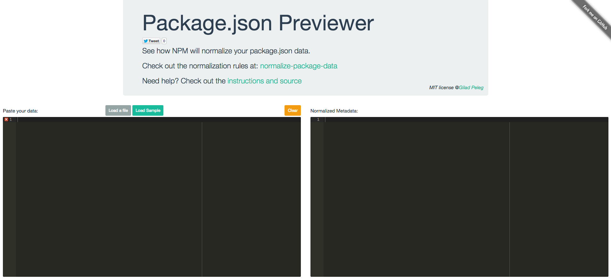

# package-json-previewer [](https://travis-ci.org/pgilad/package-json-previewer)

> Web interface to preview your normalized package.json or metadata using [normalize-package-data](https://github.com/npm/normalize-package-data)

This package is a web interface that uses [browserify](http://browserify.org/) in order to create a live preview of how your `package.json` will be transformed.

NPM transforms your `package.json` using a module named [normalize-package-data](https://github.com/npm/normalize-package-data), which mutates several parameters.

This previewer will let you quickly see how your file will be transformed.

Check out the [live site](https://pgilad.github.io/package-json-previewer/)



## Install

```sh
# clone repo
$ git clone https://github.com/pgilad/package-json-previewer

# change to cloned directory
$ cd package-json-previewer

# install dependencies
$ npm install
```

## Usage

```sh
# build, watch & run server with live-reload
$ gulp

# just compile
$ gulp build

$ launch server with live reload
$ gulp connect

# open browser at localhost:1337
```

## Test

Test using Mocha/Zombie.js/Coffee:

```sh
$ npm test
```

## License

MIT @[Gilad Peleg](http://giladpeleg.com)
